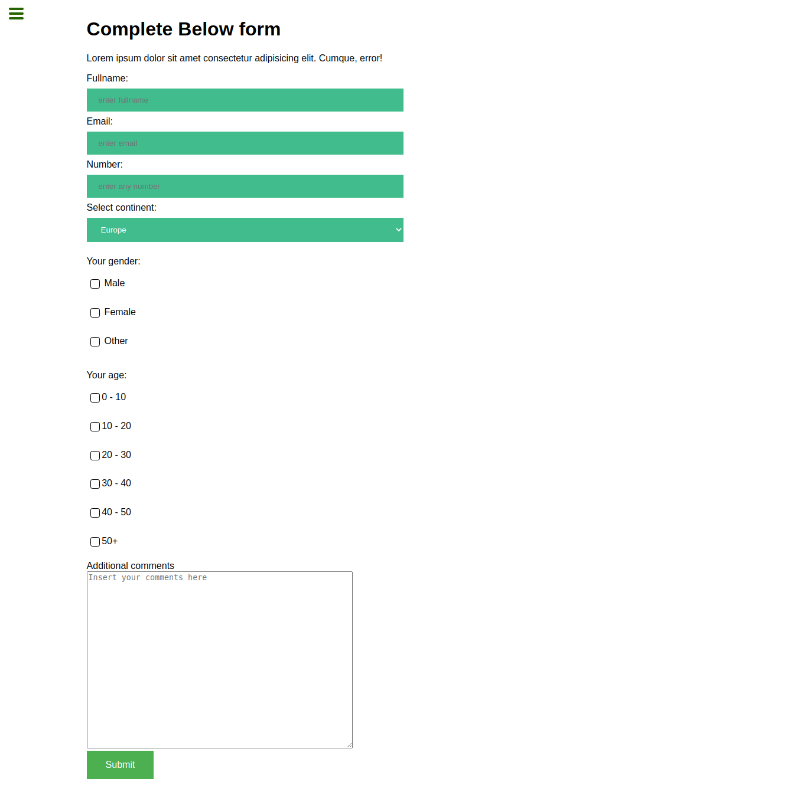

# A survey form

A survey form for collecting user experience with additional comment section

## Built With

- HTML
- CSS

## Getting Started

To get a local copy up and running follow these simple example steps.

### Prerequisites

clone repo: `git clone https://github.com/netman5/personal-review`

then
`cd code-review`

### Install

run `npm install` to install dependencies

## Authors

👤 **Author**

- GitHub: [@netman5](https://github.com/netman5)
- Twitter: [@Orlaish](https://twitter.com/Orlaish)
- LinkedIn: [LinkedIn](https://www.linkedin.com/in/ola-ishola/)

👤 **Author**

- GitHub: [@guli1918](https://github.com/guli1918)

## 🤝 Contributing

Contributions, issues, and feature requests are welcome!

Feel free to check the [issues page](../../issues/).

## Show your support

Give a ⭐️ if you like this project!

## Acknowledgments

- Hat tip to anyone whose code was used
- Inspiration
- etc

## 📝 License

This project is [MIT](./MIT.md) licensed.
